# 🩺 liveness-check

<div align="center">

**Kubernetes-native health checking for your deployments**

_Verify your pods are ready before traffic hits them_

---

<!-- Project Quality & Status -->

[](https://github.com/meysam81/liveness-check/actions)
[](https://goreportcard.com/report/github.com/meysam81/liveness-check)
[](https://github.com/meysam81/liveness-check/actions)

<!-- Distribution & Availability -->

[](https://github.com/meysam81/liveness-check/releases/latest)
[](https://hub.docker.com/r/meysam81/liveness-check)
[](https://hub.docker.com/r/meysam81/liveness-check)
[](https://ghcr.io/meysam81/liveness-check)
[](go.mod)

<!-- Features & Capabilities -->

[](https://golang.org/)
[](https://kubernetes.io/)
[](#quick-start)
[](#how-it-works)

<!-- Code Quality & Tools -->

[](https://pre-commit.com/)
[](https://12factor.net/)

<!-- License & Support -->

[](LICENSE)
[](https://github.com/sponsors/meysam81)
[](https://developer-friendly.zulipchat.com/)

[](https://github.com/sponsors/meysam81)

</div>

---

## ✨ What is liveness-check?

A **production-ready Kubernetes tool** that automatically finds your recently deployed pods and verifies they're healthy before considering your deployment successful. Perfect for **preview environments**, **CI/CD pipelines**, and **zero-downtime deployments**.

### 🎯 Why you need this

- **🔍 Preview Environments**: Ensure your feature branch is actually working before showing it to stakeholders
- **🚀 CI/CD Integration**: Block deployments until pods are genuinely ready to serve traffic
- **⚡ Zero-Downtime**: Verify new deployments without manual intervention
- **🛡️ Production Safety**: Catch deployment issues before they affect users

---

## 🚀 Quick Start

### 1. Deploy the complete solution

Head over to the [`deploy/`](./deploy/) directory and apply the provided Kubernetes Job manifest:

````bash

### 2. Customize for your app

```yaml
# Example: Check if your deployment is ready
env:
  - name: NAMESPACE
    value: "my-app-namespace"
  - name: LABEL_SELECTORS
    value: "app=my-app,version=v2.1.0"
  - name: ENDPOINT
    value: "/api/health"
````

### 3. Run and verify

The job will automatically:

- 🔎 Find your most recent pod matching the labels
- 🩺 Perform health checks with smart retry logic
- ✅ Exit successfully when your pod is ready
- 🚨 Fail fast if something's wrong

---

## 📋 Complete Job Manifest

The [`deploy/job.yml`](./deploy/job.yml) provides a **production-ready** Kubernetes Job with:

- ✅ **Security hardened** (non-root, read-only filesystem, dropped capabilities)
- ✅ **RBAC configured** with minimal required permissions
- ✅ **Resource limits** and best practices applied
- ✅ **Configurable via environment variables**

Simply apply it and customize the environment variables for your use case.

---

## ⚙️ Configuration

| Environment Variable | Description                     | Default       | Example                |
| -------------------- | ------------------------------- | ------------- | ---------------------- |
| `NAMESPACE`          | Target namespace                | `""` (all)    | `production`           |
| `LABEL_SELECTORS`    | Pod labels (comma-separated)    | **required**  | `app=api,version=v1.2` |
| `ENDPOINT`           | Health check path               | `/healthz`    | `/api/v1/health`       |
| `SCHEME`             | Protocol                        | `http`        | `https`                |
| `PORT`               | Target port                     | _auto-detect_ | `8080`                 |
| `TIMEOUT`            | Request timeout (seconds)       | `5`           | `10`                   |
| `RETRIES`            | Max retry attempts (0=infinite) | `0`           | `5`                    |
| `STATUS_CODE`        | Expected HTTP status            | `200`         | `204`                  |

---

## 🧠 How it works

```mermaid
graph LR
    A[🚀 Job Starts] --> B[🔍 Find Latest Pod]
    B --> C{📍 Pod has IP?}
    C -->|No| D[⏳ Wait + Retry]
    D --> C
    C -->|Yes| E[🩺 Health Check]
    E --> F{✅ Healthy?}
    F -->|No| G[⏳ Smart Retry]
    G --> E
    F -->|Yes| H[🎉 Success!]
```



**Smart Features:**

- 🎯 **Jitter logic** prevents thundering herd effects
- 🔄 **Exponential backoff** for failed requests
- 📊 **Millisecond precision** timing
- 🎪 **Graceful degradation** for edge cases

---

## 🏗️ Installation Options

<details>
<summary><b>🐳 Container Images</b></summary>

```bash
# GitHub Container Registry (recommended)
docker pull ghcr.io/meysam81/liveness-check:latest

# Docker Hub
docker pull meysam81/liveness-check:latest
```

</details>

<details>
<summary><b>📦 Go Install</b></summary>

```bash
go install github.com/meysam81/liveness-check@latest
```

</details>

<details>
<summary><b>🔧 Build from Source</b></summary>

```bash
git clone https://github.com/meysam81/liveness-check.git
cd liveness-check
go build -o liveness-check
```

</details>

---

## 💡 Use Cases

### 🎭 Preview Environments

```yaml
# Verify your feature branch before demo
env:
  - name: LABEL_SELECTORS
    value: "app=frontend,branch=feature-awesome-ui"
```

### 🚀 Blue-Green Deployments

```yaml
# Check new version before traffic switch
env:
  - name: LABEL_SELECTORS
    value: "app=api,version=v2.0.0,deployment=green"
```

### 🔄 Rolling Updates

```yaml
# Ensure each pod is ready during rolling update
env:
  - name: LABEL_SELECTORS
    value: "app=backend,release=canary"
```

---

<div align="center">

**Made with ❤️ for the Kubernetes community**

[⭐ Star this repo](https://github.com/meysam81/liveness-check) • [🐛 Report issues](https://github.com/meysam81/liveness-check/issues) • [💬 Get support](https://github.com/meysam81/liveness-check/discussions)

</div>
